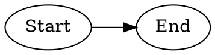
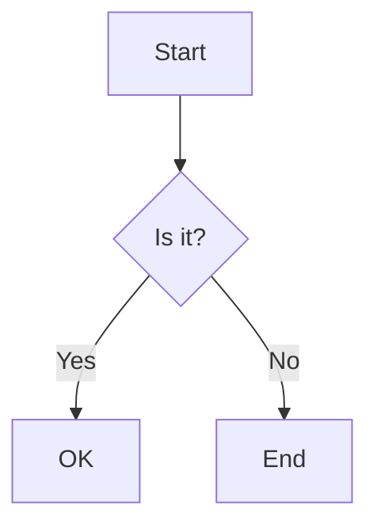
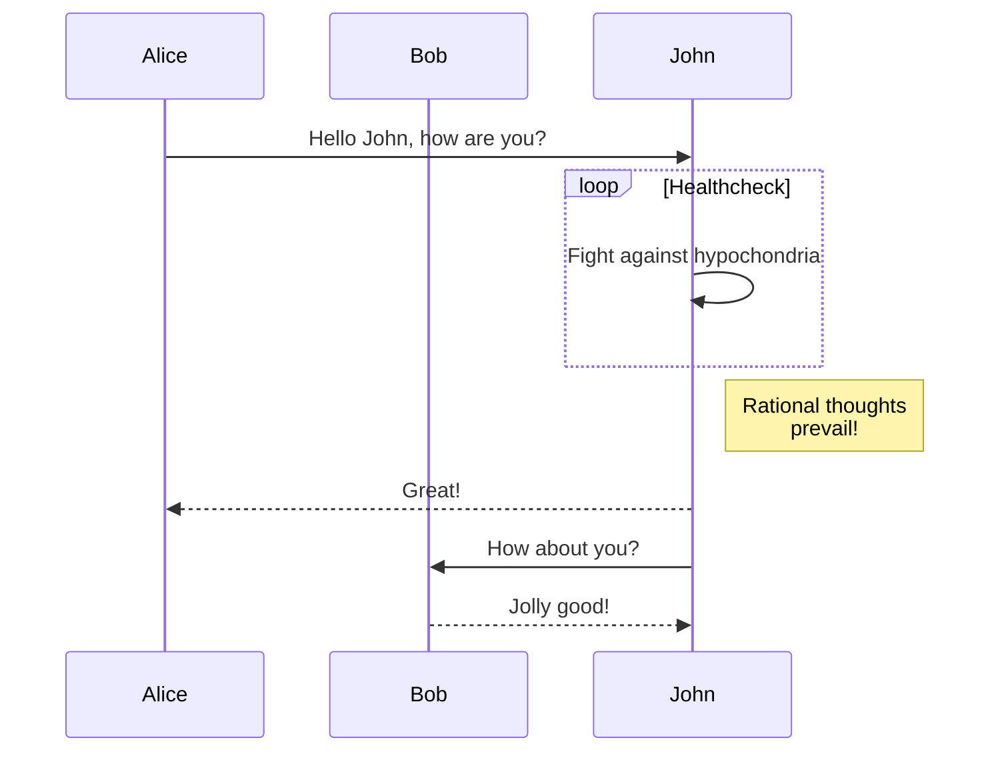

# Markdown Test File

This is a test Markdown file with various code blocks to test the Markdown parsing functionality.

## DOT Code Block



## Mermaid Code Block



## Code Block without Language Specification

```
digraph G {
  rankdir=TB;
  A -> B -> C;
}
```

## Another Mermaid Code Block



## End of File